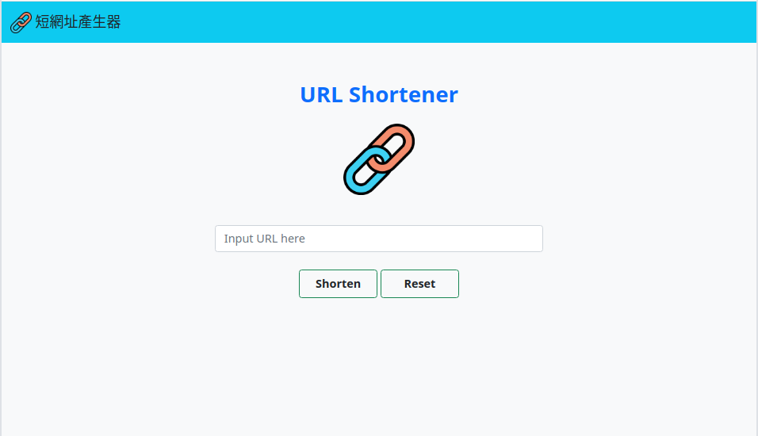

# 短網址產生器

一個短網址產生器，由伺服器產生一組短的網址，以代替原來可能較長的網址

## 功能說明

* 輸入網址後，產生帶5位數亂碼之短網址
* 輸入相同網址時，產生一樣的縮址
* 提供一鍵複製功能
* 提供QRcode供掃描使用


## 安裝與執行

1. 請先確認安裝有node.js及npm
2. 開啟終端機，進入專案目錄，並從github下載資料

```
> git clone https://github.com/erikku54/ac-urlShortener.git
```

3. 安裝套件

```
> cd ac-urlShortener
> npm install
```

4. 設定環境變數: 在專案資料夾下新增.env檔案，並填入你的MongoDB連線字串
```
MONGODB_URI = "<你的連線字串>"

```

5. 執行程式，啟動監聽

```
> npm run start
```

6. 啟動程式後，開啟瀏覽器並至http://localhost:3000開始瀏覽


## 畫面截圖




## 開發環境與套件

* VS Code - 編程環境
* node.js / express.js@4.18.2- 後端框架
* express-handlebars@7.0.2 - 樣板引擎
* bootstrap@5.2.3 - 樣式
* fontawesome@5.8.1 (CDN) - icon
* mongoose@7.0.2 - 連結MongoDB資料庫
* qrcode@1.5.1 (CDN) - 產生QR code

底下為開發中使用
* dotenv@16.0.3 - 管理環境變數
* eslint@8.36.0 - 代碼風格

## 作者

* **Eric Huang** 